# BRConnector CloudFormation 法兰克福区域部署指南 - fix版本

本文档提供了使用 CloudFormation 在 法兰克福eu-central-1 部署 BRConnector 的详细指南。

## 文件说明

- **`vpc-brconnector-frankfurt-fixedbyliangym.yaml`: 修复后的 CloudFormation 模板，解决了原始模板中的错误**
- ~~`quick-build-brconnector.yaml`: 原始 CloudFormation 模板，不支持在法兰克福区域部署，美国区域OK~~
- 完整的快速部署内容，参考官网这里：https://aws-samples.github.io/sample-connector-for-bedrock/zh/home/deployment/

## 一、部署步骤

### 1. 准备工作

确保您已经：
- 安装并配置了 AWS CLI
- 拥有足够的权限来创建所需资源
- 确定了要部署的区域（例如：eu-central-1 法兰克福）

### 2. 创建 S3 存储桶用于存储模板

由于 CloudFormation 模板大小超过 51,200 字节，需要通过 S3 存储桶部署。使用日期作为存储桶名称的一部分，以避免命名冲突：

```bash
# 创建包含日期的唯一存储桶名称
BUCKET_NAME="brconnector-cfn-$(date +%Y%m%d)-$(openssl rand -hex 4)"
echo "使用存储桶名称: $BUCKET_NAME"

# 创建 S3 存储桶
aws s3api create-bucket --bucket $BUCKET_NAME --create-bucket-configuration LocationConstraint=eu-central-1 --region eu-central-1
```

上传 CloudFormation 模板到 S3 存储桶：

```bash
aws s3 cp vpc-brconnector-frankfurt-fixedbyliangym.yaml s3://$BUCKET_NAME/ --region eu-central-1
```

### 3. 获取 VPC 和子网信息

自动获取默认 VPC 和子网信息，并将其保存为变量以便后续使用：

```bash
# 设置区域
REGION="eu-central-1"

# 获取默认 VPC ID
VPC_ID=$(aws ec2 describe-vpcs --region $REGION --filters "Name=isDefault,Values=true" --query "Vpcs[0].VpcId" --output text)
echo "默认 VPC ID: $VPC_ID"

# 获取公有子网（MapPublicIpOnLaunch=true）
PUBLIC_SUBNETS=($(aws ec2 describe-subnets --region $REGION --filters "Name=vpc-id,Values=$VPC_ID" "Name=map-public-ip-on-launch,Values=true" --query "Subnets[*].SubnetId" --output text))
echo "公有子网: ${PUBLIC_SUBNETS[@]}"

# 获取私有子网（MapPublicIpOnLaunch=false）
PRIVATE_SUBNETS=($(aws ec2 describe-subnets --region $REGION --filters "Name=vpc-id,Values=$VPC_ID" "Name=map-public-ip-on-launch,Values=false" --query "Subnets[*].SubnetId" --output text))
echo "私有子网: ${PRIVATE_SUBNETS[@]}"

# 检查子网数量并提供解决方案
if [ ${#PUBLIC_SUBNETS[@]} -lt 2 ] || [ ${#PRIVATE_SUBNETS[@]} -lt 2 ]; then
  echo "警告: 没有足够的公有或私有子网。至少需要 2 个公有子网和 2 个私有子网。"
  echo "找到的公有子网数量: ${#PUBLIC_SUBNETS[@]}"
  echo "找到的私有子网数量: ${#PRIVATE_SUBNETS[@]}"
  
  # 如果有足够的子网总数，但分布不均，可以手动指定
  TOTAL_SUBNETS=$((${#PUBLIC_SUBNETS[@]} + ${#PRIVATE_SUBNETS[@]}))
  if [ $TOTAL_SUBNETS -ge 4 ]; then
    echo "总共有 $TOTAL_SUBNETS 个子网，可以手动指定子网 ID 继续部署。"
    
    # 示例：手动指定子网 ID
    echo "# 手动指定子网 ID 示例："
    echo "# PUBLIC_SUBNET_1=\"subnet-xxxx\""
    echo "# PUBLIC_SUBNET_2=\"subnet-yyyy\""
    echo "# PRIVATE_SUBNET_1=\"subnet-zzzz\""
    echo "# PRIVATE_SUBNET_2=\"subnet-wwww\""
  else
    echo "您可能需要创建额外的子网或选择其他 VPC。"
  fi
  exit 1
fi

# 选择前两个子网，确保索引存在
PUBLIC_SUBNET_1="${PUBLIC_SUBNETS[0]}"
PUBLIC_SUBNET_2="${PUBLIC_SUBNETS[1]}"
PRIVATE_SUBNET_1="${PRIVATE_SUBNETS[0]}"
PRIVATE_SUBNET_2="${PRIVATE_SUBNETS[1]}"

echo "选择的子网:"
echo "公有子网 1: $PUBLIC_SUBNET_1"
echo "公有子网 2: $PUBLIC_SUBNET_2"
echo "私有子网 1: $PRIVATE_SUBNET_1"
echo "私有子网 2: $PRIVATE_SUBNET_2"
```

### 4. 部署 CloudFormation 堆栈

使用自动获取的 VPC 和子网信息部署 CloudFormation 堆栈：

```bash
# 使用 create-stack 命令而不是 deploy
aws cloudformation create-stack \
  --stack-name brconnector-frankfurt \
  --template-url https://$BUCKET_NAME.s3.eu-central-1.amazonaws.com/vpc-brconnector-frankfurt-fixedbyliangym.yaml \
  --capabilities CAPABILITY_IAM CAPABILITY_NAMED_IAM CAPABILITY_AUTO_EXPAND \
  --region eu-central-1 \
  --parameters \
    ParameterKey=VpcId,ParameterValue=$VPC_ID \
    ParameterKey=PublicSubnet1Id,ParameterValue=$PUBLIC_SUBNET_1 \
    ParameterKey=PublicSubnet2Id,ParameterValue=$PUBLIC_SUBNET_2 \
    ParameterKey=PrivateSubnet1Id,ParameterValue=$PRIVATE_SUBNET_1 \
    ParameterKey=PrivateSubnet2Id,ParameterValue=$PRIVATE_SUBNET_2
```

### 5. 监控堆栈创建进度

您可以使用以下命令监控堆栈创建进度：

```bash
# 查看堆栈状态
aws cloudformation describe-stacks --stack-name brconnector-frankfurt --region eu-central-1 --query "Stacks[0].StackStatus"

# 查看详细事件
aws cloudformation describe-stack-events --stack-name brconnector-frankfurt --region eu-central-1
```

等待堆栈状态变为 `CREATE_COMPLETE`，这可能需要 15-20 分钟。

### 6. 登录AWS控制台看更多信息 

一旦堆栈创建完成，您可以查看输出参数，包括 CloudFront 域名等信息：

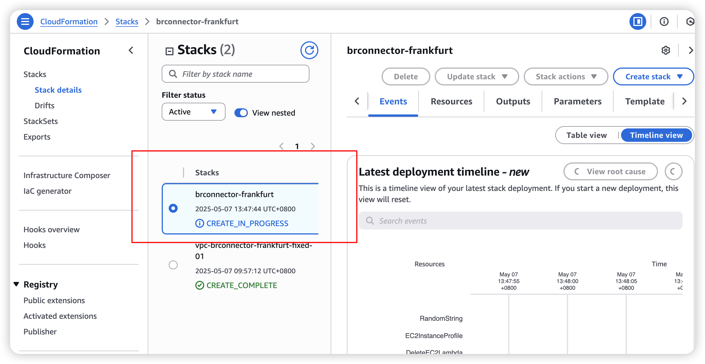

### 主要参数说明

| 参数名 | 描述 | 默认值 |
|--------|------|--------|
| VpcId | 部署 BRConnector 的 VPC | - |
| PublicSubnet1Id | 第一个公有子网 | - |
| PublicSubnet2Id | 第二个公有子网 | - |
| PrivateSubnet1Id | 第一个私有子网 | - |
| PrivateSubnet2Id | 第二个私有子网 | - |
| ComputeType | 计算类型：ec2、lambda 或 ecs | ec2 |
| EC2InstanceType | EC2 实例类型 | t3.medium |
| DatabaseMode | 数据库模式：Standalone、EC2Integrated 或 NoDB | EC2Integrated |
| PGDatabase | PostgreSQL 数据库名称 | brconnector_db |
| PGUser | PostgreSQL 用户名 | postgres |
| PGPassword | PostgreSQL 密码 | mysecretpassword |
| EnableCloudfront | 是否启用 CloudFront | true |
| BRConnectorVersion | BRConnector 版本 | latest |
| AutoUpdateBRConnector | 是否自动更新 BRConnector | true |

### 故障排除 常见错误

1. **堆栈创建失败**：检查 VPC 和子网 ID 是否正确
   
   ```bash
   aws cloudformation describe-stack-events --stack-name brconnector-frankfurt --region eu-central-1
   ```
   
2. **参数格式错误**：确保使用正确的参数格式
   ```bash
   # 正确的参数格式示例
   --parameters \
     ParameterKey=VpcId,ParameterValue=$VPC_ID \
     ParameterKey=PublicSubnet1Id,ParameterValue=$PUBLIC_SUBNET_1
   ```

3. **ROLLBACK_COMPLETE 状态**：需要先删除堆栈再重新部署
   ```bash
   aws cloudformation delete-stack --stack-name brconnector-frankfurt --region eu-central-1
   aws cloudformation wait stack-delete-complete --stack-name brconnector-frankfurt --region eu-central-1
   ```

4. **安全组错误**：确保安全组配置正确，特别是 `RdsSecurityGroupIngress` 资源

5. **子网配置问题**：确保选择了正确的公有和私有子网
   ```bash
   # 检查子网配置
   aws ec2 describe-subnets --subnet-ids $PUBLIC_SUBNET_1 $PUBLIC_SUBNET_2 $PRIVATE_SUBNET_1 $PRIVATE_SUBNET_2 --region eu-central-1 --query "Subnets[*].[SubnetId,MapPublicIpOnLaunch,AvailabilityZone]"
   ```

6. **模板URL错误**：确保S3存储桶URL格式正确
   ```bash
   # 验证模板URL是否可访问
   aws s3 ls s3://$BUCKET_NAME/vpc-brconnector-frankfurt-fixedbyliangym.yaml --region eu-central-1
   ```


## 二、访问 BRConnector

部署成功后，登录AWS 在cloudformation -> stacks 的 **OUTPUT** 可以获得全部的资源信息，您可以通过以下方式访问 BRConnector：

1. **CloudFront URL**：`https://<CloudFront-Domain>/`
2. **管理界面**：`https://<CloudFront-Domain>/manager`
3. **BRClient WebUI**：`https://<CloudFront-Domain>/brclient`

###  1. 登录AWS控制台查看部署输出

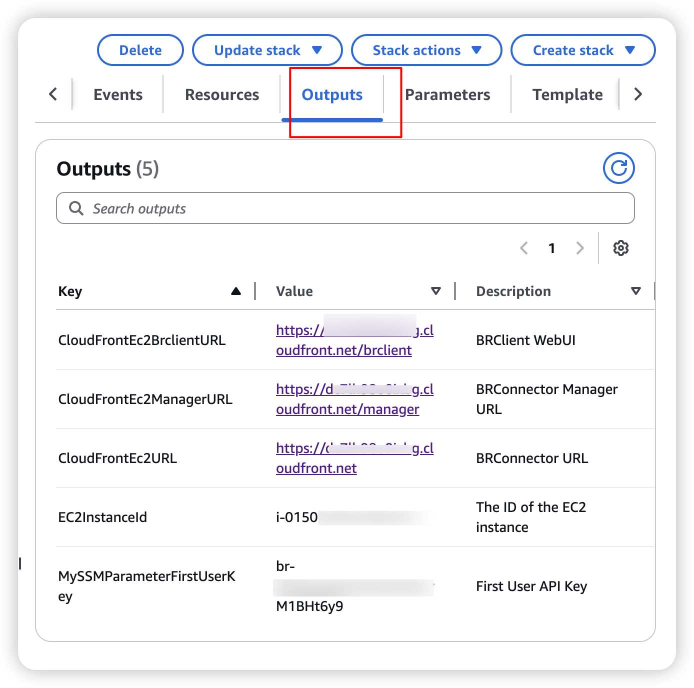

### 2. 通过使用 Sample client for Bedrock 快速验证模型效果

**AWS提供了一个简单好用的客户端《BRClient WebUl》来调用bedrock大模型实现对话，这个过程也验证了BRConnector把bedrock-converse API转换为 OpenAI 兼容API的过程！**

### 简介

- Sample client for Bedrock (BRClient) 是一个样例项目，用于展示如何构建一个连接 Bedrock 大语言模型的客户端。
- 他除了可以在客户端直接发起对 Bedrock 的调用，还可以设置本项目(BRConnector)成为他的 API 后端。

- 项目地址: aws-samples/sample-client-for-amazon-bedrock


### 快速启动

- 您可以直接通过源代码启动 BRClient，也可以下载各个平台的安装程序。
- 如果您部署了本项目（BRConnector），可以直接通过这个 URL 启动：http(s)://your-endpoint/brclient/。


### 设置

- 进入 Web 界面后，您需要在设置中启用 BRConnector。

- BRConnector setting

- 其中 BRConnector Endpoint 填写您的 BRConnector 的路径的根即可。

- API Key 填写 BRConnector 颁发的 Key。

- 设置好之后，您可以刷新页面，从 BRConnector 中获取模型列表。以后每次设置好新的模型后，都可以通过刷新页面获取新模型的列表。

**完整教程参考这里：https://aws-samples.github.io/sample-connector-for-bedrock/zh/user-manual/scenarios/sample-client-for-bedrock/**


## 三、修改BRConnector的配置参数，确保AWS法兰克福eu-central-1区域的Bedrock中的amazon自研模型nova能够正确工作

修改BRConnector的配置参数，确保AWS法兰克福eu-central-1区域的Bedrock中的amazon自研模型nova能够正确工作，操作步骤如下：

#### 1. 登录BRConnector管理界面，编辑三个Nova模型

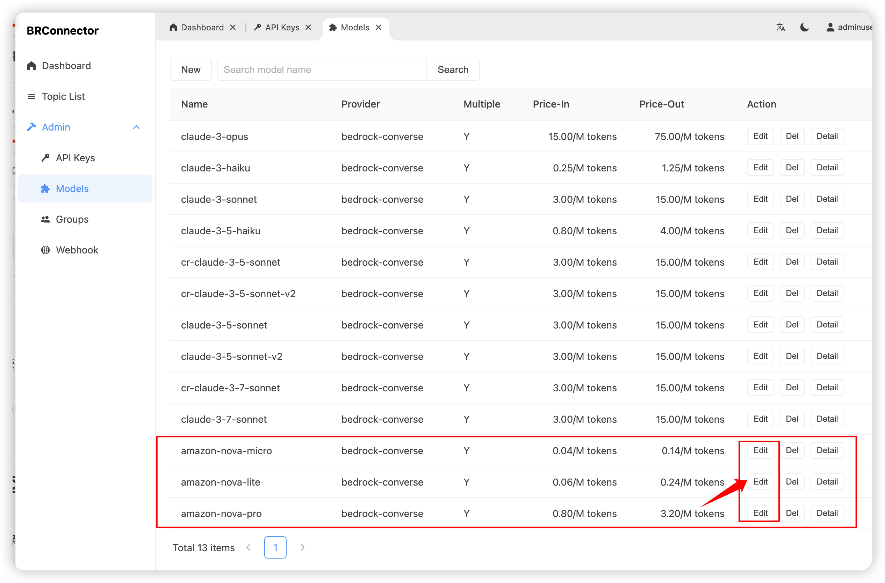


#### 2. 对每个nova模型增加 eu. 前缀，确保能调用欧洲本地模型，如下图

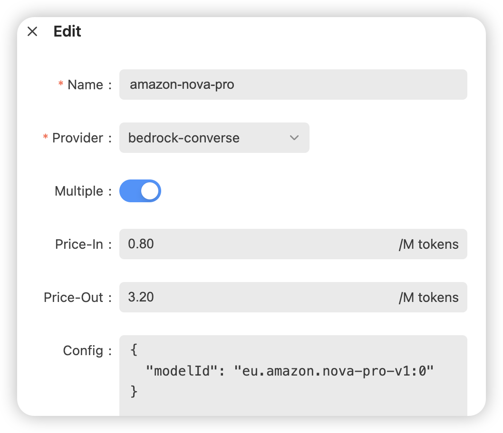
```bash
{
  "modelId": "eu.amazon.nova-pro-v1:0"
}
```

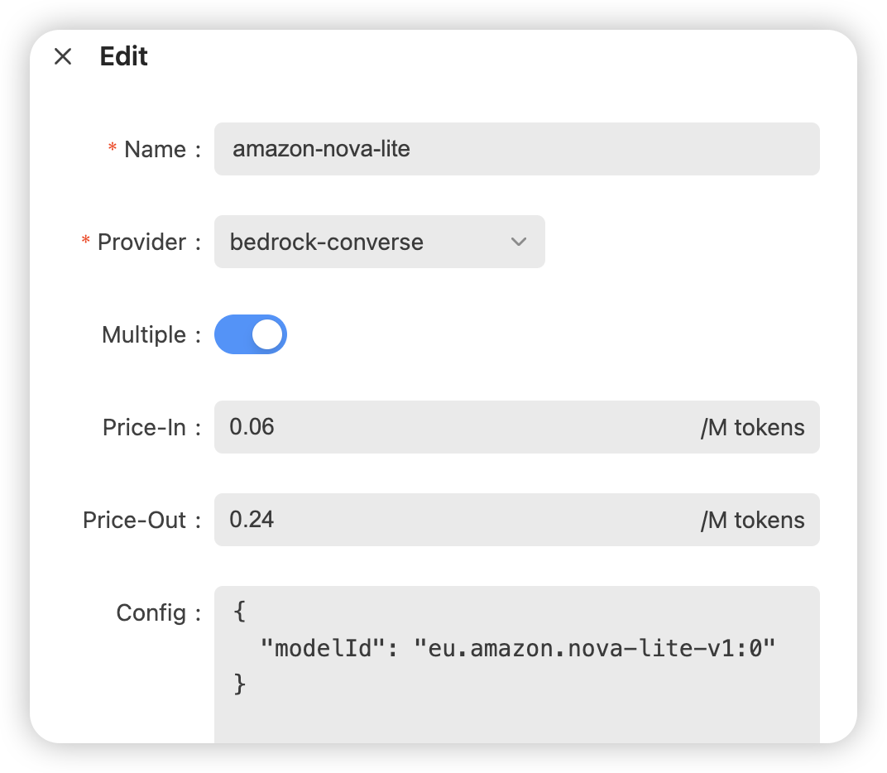
```bash
{
  "modelId": "eu.amazon.nova-lite-v1:0"
}
```

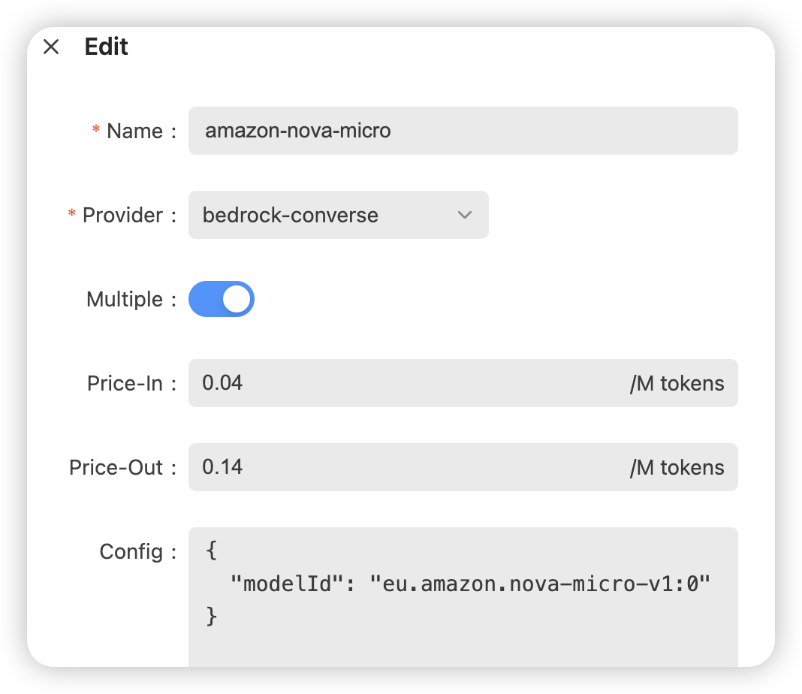
```bash
{
  "modelId": "eu.amazon.nova-micro-v1:0"
}
```


## 四、使用 BRConnector 的OpenAI 兼容API

#### 1. 如下的方法来访问 BRConnector。

- [直接访问 API](https://aws-samples.github.io/sample-connector-for-bedrock/zh/user-manual/apis/)
- [使用 Sample Client for Bedrock(BRClient)](https://aws-samples.github.io/sample-connector-for-bedrock/zh/user-manual/scenarios/sample-client-for-bedrock/)
- 使用其他与 OpenAI 兼容的客户端

现在市面上已经有很多 OpenAI 的客户端，有些客户端可以设置 Host 和 API key，您可以直接复用这些客户端。


#### 2. API调用方式，mac命令行直接执行：

``` 
curl -X POST 'https://xxxxx.cloudfront.net/v1/chat/completions' \
-H 'Content-Type: application/json' \
-H 'Authorization: Bearer br-xxxxx' \
--data '{
  "model": "amazon-nova-pro",
  "messages": [
    {
      "role": "user",
      "content": "测试"
    }
  ],
  "stream": true,
  "temperature": 1,
  "max_tokens": 4096
}'

```

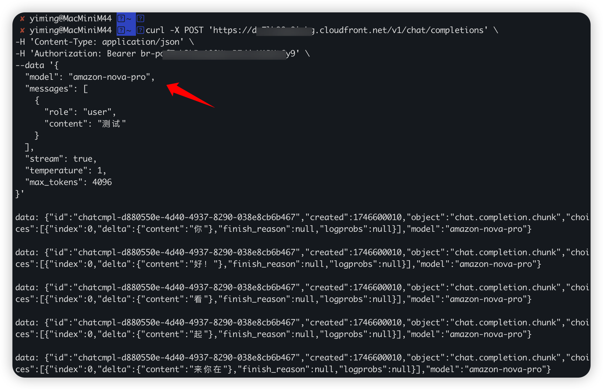

#### 2. API调用成功，您可以啥用使用其他与 OpenAI 兼容的客户端了


## 五、⾼并发压⼒在 Bedrock上的建议与最佳实践 

### 1、Bedrock配额调整需求

模型默认配额情况(以美⻄2区为例):

**<u>Nova Pro:</u>**
**200 RPM** (每分钟请求数) tokens per minute
**800K TPM**(每分钟令牌数) Requests per minute

<u>Claude-3.5:</u>
250 RPM (每分钟请求数) tokens per minute
2M TPM (每分钟令牌数) Requests per minute

**配额提升建议:**

- 在Service Quota中检查当前限制
- 根据业务需求评估稳定状态(steady)和峰值(peak)的RPM和TPM
- 提前申请提升配额

**AWS Console查询⽅法和修改⽅法（图⽂教程）**
https://eu-central-1.console.aws.amazon.com/servicequotas/home/services/bedrock/quotas?region=eu-central-1

**关键字：tokens per minute**

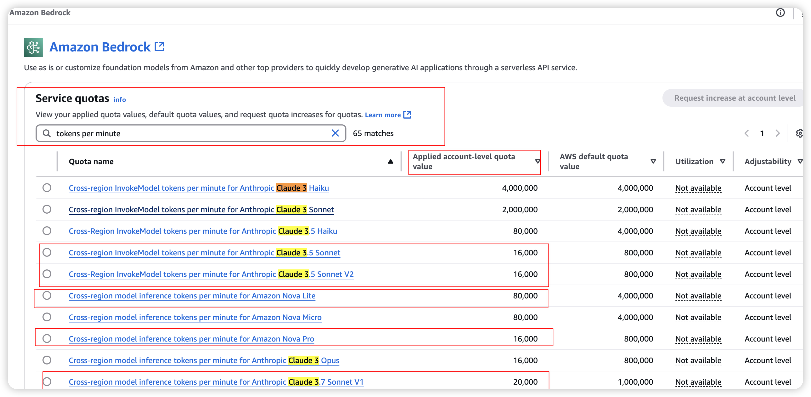

**关键字：Requests per minute**

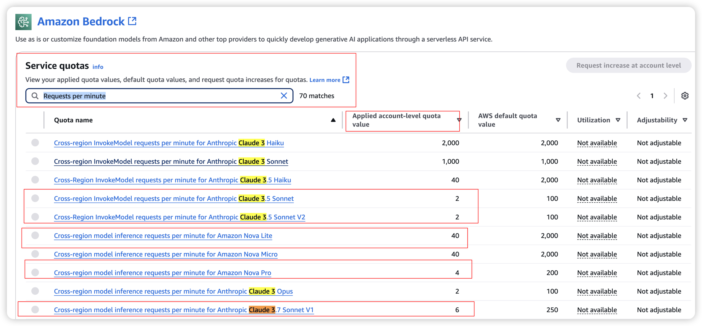


**2）Bedrock的功能优化建议**

- 开启：Bedrock跨区域⽀持:
- 启⽤Cross Region功能

- 后端⾃动路由机制


## 六、如何troubleshooting BRConnector + AWS Bedrock

#### 1. Troubleshooting BRConnector 

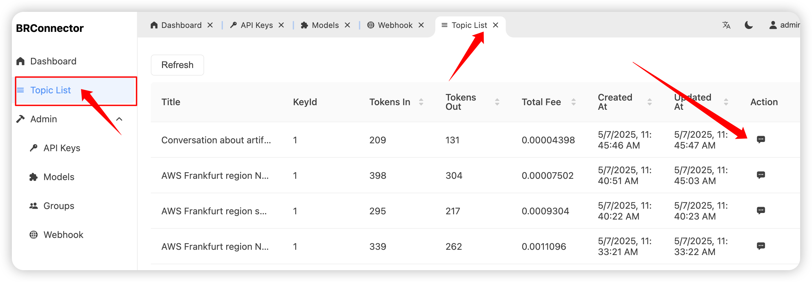

#### 2. Troubleshooting  AWS Bedrock

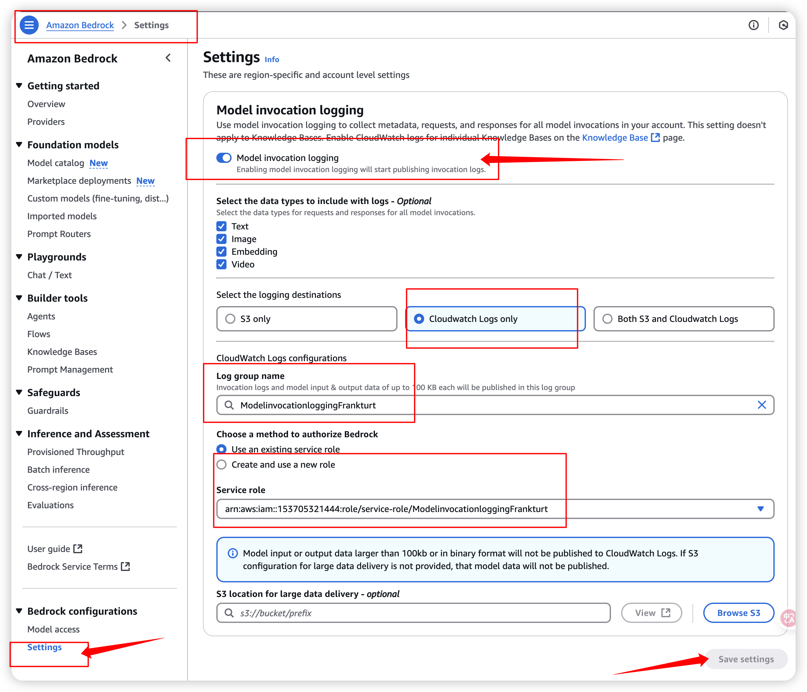

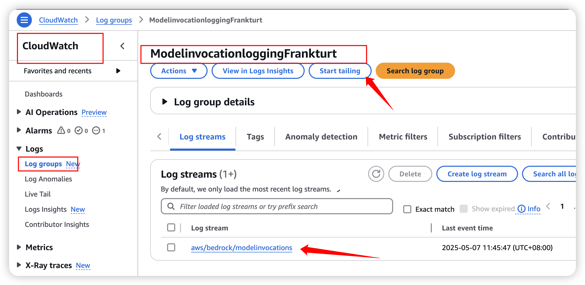


## ~~如果不再使用，如何清理资源~~

~~当不再需要 BRConnector 时，可以删除堆栈：~~

```bash
aws cloudformation delete-stack --stack-name brconnector-frankfurt --region eu-central-1
```
